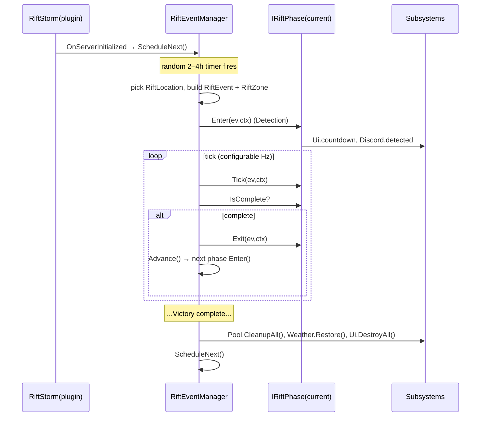

# Step 03 — Class Diagram

## UML-style overview (Mermaid)

```mermaid
classDiagram
    class RiftStorm {
        +OnServerInitialized()
        +Unload()
        -RiftContext ctx
        -RiftEventManager events
        -Configuration config
        -BuildContainer()
    }

    class RiftContext {
        +Configuration Config
        +RiftLogger Logger
        +EntityPool Pool
        +WeatherController Weather
        +RiftController Rift
        +NpcManager Npcs
        +BossController Boss
        +LootManager Loot
        +UiManager Ui
        +INotifier Discord
        +ApiService Api
        +Broadcast(string)
        +Timer(float, Action)
    }

    class RiftEventManager {
        -List~IRiftPhase~ phases
        -RiftEvent active
        -Timer scheduleTimer
        -Timer tickTimer
        +ScheduleNext()
        +StartEvent(RiftLocation)
        +StopEvent(bool victory)
        +Tick()
        -Advance()
    }

    class IRiftPhase {
        <<interface>>
        +RiftPhaseId Id
        +Enter(RiftEvent, RiftContext)
        +Tick(RiftEvent, RiftContext)
        +Exit(RiftEvent, RiftContext)
        +IsComplete(RiftEvent) bool
    }

    class RiftEvent {
        +RiftPhaseId Phase
        +RiftLocation Location
        +Vector3 Center
        +float Stability
        +int WaveIndex
        +int CrystalsAlive
        +BaseCombatEntity Boss
        +DateTime StartedUtc
        +HashSet~ulong~ Participants
        +RiftZone Zone
    }

    class WeatherController {
        +RampUp(RiftEvent)
        +Restore()
        +SpawnAtmosphere(Vector3)
    }
    class RiftController {
        +SpawnRift(Vector3)
        +SpawnCrystals(Vector3,int)
        +Pulse()
        +OnCrystalDestroyed(entity)
        +event CrystalDestroyed
    }
    class NpcManager {
        +SpawnWave(int)
        +AliveCount() int
        +event WaveCleared
        -ApplyProfile(npc, NpcProfile)
    }
    class BossController {
        +SpawnBoss(Vector3)
        +Tick()
        +event BossDefeated
        -EmpPulse() -Lightning() -Summon() -EnterRage()
    }
    class LootManager {
        +FillCorpse(npc, LootTable)
        +SpawnRiftCrate(Vector3)
        +GrantRewards(player)
    }
    class UiManager {
        +ShowHud(player)
        +UpdateCountdown(secs)
        +UpdateStability(pct)
        +UpdateWave(i)
        +UpdateBossBar(pct)
        +UpdateZonePlayers(n)
        +DestroyAll()
    }
    class INotifier {
        <<interface>>
        +Notify(RiftNotice)
    }
    class DiscordService { +Notify(RiftNotice) }
    class ApiService { +Push(RiftEvent) +BuildStatusJson() }
    class RiftZone {
        +Vector3 Center
        +float Radius
        +Contains(Vector3) bool
        +PlayersInside() List~BasePlayer~
        +Register(BaseEntity)
        +CleanupAll()
    }
    class EntityPool { +Take() +Return() +CleanupAll() }
    class RiftLogger { +Info() +Warn() +Error() +Perf() }

    RiftStorm --> RiftContext : builds
    RiftStorm --> RiftEventManager : owns
    RiftEventManager --> IRiftPhase : runs ordered
    RiftEventManager --> RiftEvent : holds active
    RiftContext --> WeatherController
    RiftContext --> RiftController
    RiftContext --> NpcManager
    RiftContext --> BossController
    RiftContext --> LootManager
    RiftContext --> UiManager
    RiftContext --> INotifier
    RiftContext --> ApiService
    RiftContext --> RiftLogger
    RiftContext --> EntityPool
    DiscordService ..|> INotifier
    RiftEvent --> RiftZone
    IRiftPhase <|.. DetectionPhase
    IRiftPhase <|.. StormPhase
    IRiftPhase <|.. RiftPhase
    IRiftPhase <|.. WavesPhase
    IRiftPhase <|.. ObjectivesPhase
    IRiftPhase <|.. BossPhase
    IRiftPhase <|.. VictoryPhase
```

## Phase → manager interaction matrix

| Phase | Weather | Rift | Npc | Boss | Loot | Ui | Discord | Api |
| ----- | :----: | :--: | :-: | :--: | :--: | :-: | :-----: | :-: |
| Detection | — | — | — | — | — | ● countdown | ● detected | ● |
| Storm | ● ramp + FX | — | — | — | — | ● | ● active | ● |
| Rift | ● sustain | ● spawn+pulse | — | — | — | ● | — | ● |
| Waves | ● | ● pulse | ● spawn waves | — | ● corpses | ● wave/zone | — | ● |
| Objectives | ● | ● crystals+stability | ● trickle | — | ● | ● stability/crystals | — | ● |
| Boss | ● | ● | ● summon | ● abilities | ● | ● boss bar | ● spawned | ● |
| Victory | ● restore | ● explode | ● clear | ● | ● crate+grant | ● rewards | ● defeated | ● |

`●` = active, `—` = idle. Note every phase feeds **Ui** and most feed **Api**.

## Lifecycle sequence (happy path)

Next: **[Step 04 — Configuration](04-configuration.md)**.
